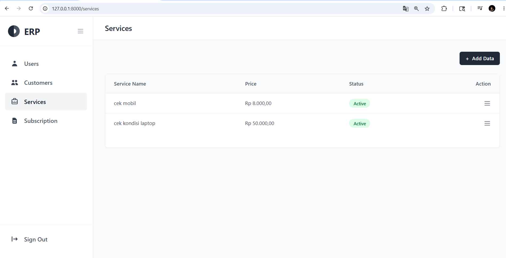
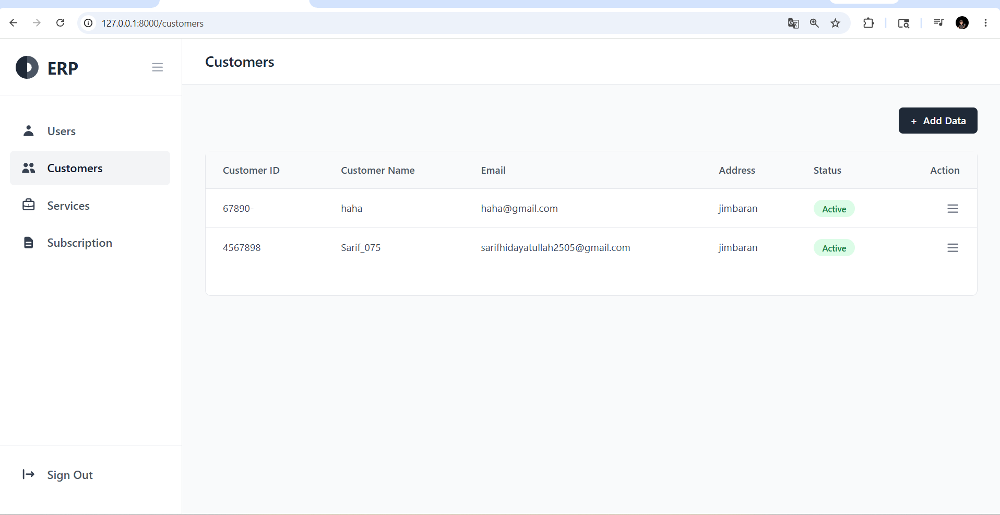
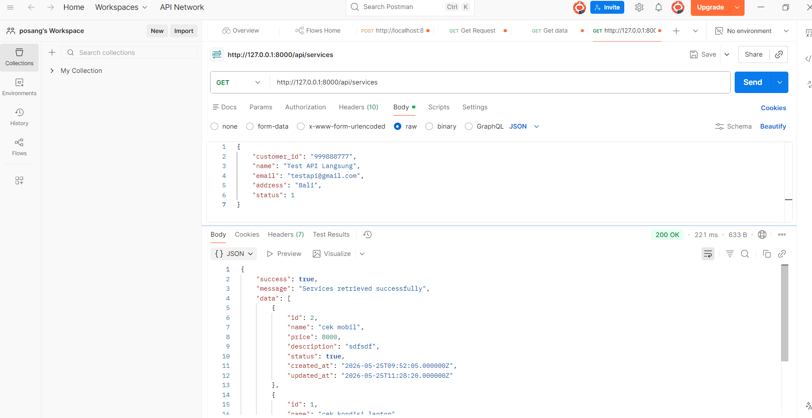
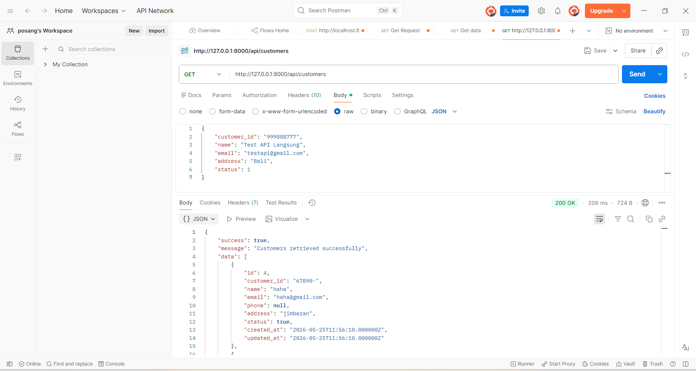

# Dokumentasi Final Project Laravel WEB API & Frontend

Nama: Sarif Hidayatullah
NIM: 2415354075
Kelas:4C TRPL

Project ini merupakan implementasi Backend API dan Frontend untuk mengelola data Service, Customer, dan Subscription.

---

## 💻 Tampilan Frontend (Web)

### 1. Halaman Services
Menampilkan halaman pengelolaan data layanan (Service).

### 2. Halaman Customers
Menampilkan halaman pengelolaan data pelanggan (Customer).

### 3. Halaman Subscriptions
Menampilkan halaman data langganan yang menghubungkan pelanggan dengan layanan.

---

## ⚙️ Dokumentasi Backend (Testing via Postman)

### 1. Endpoint Services
**GET** `/api/services` (Menampilkan semua data service)

### 2. Endpoint Customers
**GET** `/api/customers` (Menampilkan semua data customer)

### 3. Endpoint Subscriptions
**GET** `/api/subscriptions` (Menampilkan semua data langganan)
